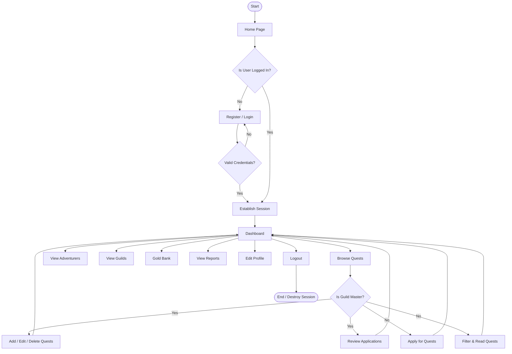

# Adventurer Guild Registration & Quest Board

**CCS0043 Final Project | FEU Institute of Technology**

## I. System Title
Adventurer Guild Registration & Quest Board

## II. System Description

### A. Overview of the System
The Adventurer Guild Registration & Quest Board is a web-based management system built using PHP and MySQL. It serves as a digital hub where adventurers can register, log in, browse available quests, and manage their quest assignments. Guild Masters (admins) can post new quests, assign them to adventurers, edit or delete quests, and view reports about quest completion rates and adventurer statistics.

### B. Problem Being Addressed
In many fantasy role-playing environments or gaming guilds, managing quests, tracking adventurer progress, and coordinating between Guild Masters and adventurers can be chaotic when done manually (e.g., using spreadsheets or chat logs). This system provides a centralized, organized platform to streamline quest management and adventurer registration, ensuring data persistence and secure access.

### C. Target Users
1. **Guild Masters (Admins):** Users with elevated privileges who can post quests, manage the entire quest board, review adventurer applications, issue gold rewards, and view comprehensive guild reports.
2. **Adventurers:** Regular users who can register, browse available quests, apply for quests, update their own profiles, join guilds, and track their gold earnings.

### D. Main Features of the System
1. **User Authentication:** Secure registration and login system using PHP sessions and bcrypt password hashing.
2. **Quest Management (CRUD):** Full Create, Read, Update, and Delete operations for quests.
3. **Quest Application System:** Adventurers can apply for open quests; Guild Masters review and approve/reject applications. When approved, the quest is automatically assigned to the adventurer.
4. **Adventurer Directory:** A public directory viewing all registered adventurers, their classes, levels, and guild affiliations.
5. **Profile Management:** Users can view and edit their own profiles, upload profile pictures (avatars), and select guild affiliation.
6. **Guild System:** Five pre-defined guilds (Hunters Guild, Mages Guild, Iron Vanguard, Shadow Syndicate, Verdant Circle) with member tracking.
7. **Gold Bank System:** A virtual banking system where adventurers track their gold balance, view transaction history, and Guild Masters can issue quest rewards.
8. **Filtering & Search:** Filter quests by status (Open, In Progress, Completed) and difficulty (Easy to Legendary).
9. **Reports & Statistics:** Dashboard and reports page showing quest statistics, adventurer counts by class and guild, and quest application summaries using MySQL aggregation queries.

## III. System Objectives

### A. General Objective
To develop a fully functional, dynamic web application using PHP and MySQL that demonstrates a comprehensive understanding of web development concepts, including database integration, session management, file uploads, form validation, and relational data modeling.

### B. Specific Objectives
1. To implement secure user registration and login functionality with proper input validation and session handling.
2. To design and integrate a MySQL relational database with multiple related tables to store and retrieve user, quest, guild, application, wallet, and transaction data persistently.
3. To develop a user-friendly interface that allows Guild Masters to manage quests (Create, Read, Update, Delete) and review quest applications.
4. To create an adventurer directory, guild system, and banking system to display guild statistics clearly.
5. To implement file upload functionality for profile pictures with proper validation.
6. To demonstrate good UI/UX practices and code organization using reusable functions and includes.

## IV. System Flowchart

### A. Flowchart Title
Adventurer Guild System User Flow

### B. Flowchart Description
The system begins with the Home Page. Unauthenticated users can navigate to the About page or choose to Register. Upon successful registration, the user selects a guild affiliation and can upload a profile picture. After logging in successfully, the user's session is established, and they are redirected to the Dashboard. From the Dashboard, the user can access the Quest Board, Adventurer Directory, Guilds, Gold Bank, Reports, or their own Profile. Adventurers can apply for quests and Guild Masters review applications. Guild Masters can also issue gold rewards through the banking system.

### C. Flowchart Diagram

## V. Instructions for Setup (XAMPP)

1. **Install XAMPP:** Ensure XAMPP is installed on your computer and the Apache and MySQL modules are started.
2. **Copy Files:** Copy `quest_board` folder into your XAMPP `htdocs` directory (usually located at `C:\xampp\htdocs\`).
3. **Create Upload Directories:** Make sure the following directories exist and are writable:
   - `C:\xampp\htdocs\quest_board\uploads\avatars\`
   - `C:\xampp\htdocs\quest_board\uploads\quests\`
4. **Create Database:**
   - Open web browser and navigate to `http://localhost/phpmyadmin`.
   - Create a new database named `quest_board_db` (or just import the SQL file directly).
5. **Import SQL:**
   - Select the `quest_board_db` database.
   - Click on the "Import" tab.
   - Choose the `setup.sql` file located in `quest_board/sql/setup.sql` and click "Go" to execute the script.
   - Alternatively, you can copy the SQL code inside `setup.sql` and paste it into the SQL tab in phpMyAdmin.
6. **Run the Application:**
   - Open your web browser and navigate to `http://localhost/quest_board/`.
7. **Default Login (Guild Master):**
   - **Username:** `guild_master`
   - **Password:** `password`

### Sample Adventurer Accounts (all use password: `password`)
| Username | Full Name | Class | Guild |
|----------|-----------|-------|-------|
| shadow_strike | Kaelen Nightblade | Rogue | Shadow Syndicate |
| arcane_wisdom | Elara Moonwhisper | Wizard | Mages Guild |
| iron_heart | Thorgar Ironheart | Warrior | Iron Vanguard |
| green_arrow | Lyanna Swiftwind | Ranger | Hunters Guild |
| druid_keeper | Orion Mosswood | Druid | Verdant Circle |

## VI. Database Structure

### Tables
| Table | Description |
|-------|-------------|
| `guilds` | Guild definitions (name, description, color) |
| `users` | Adventurer accounts (profile, class, level, guild, avatar) |
| `quests` | Quest records (title, description, difficulty, reward, status) |
| `quest_applications` | Adventurer quest applications (pending/approved/rejected) |
| `wallets` | User gold balances |
| `transactions` | Gold transaction history (rewards, spending) |

### Relationships
- Users belong to Guilds (many-to-one)
- Quests are created by Users (many-to-one)
- Quests are assigned to Users (many-to-one)
- Quest Applications link Users to Quests (many-to-one each)
- Wallets belong to Users (one-to-one)
- Transactions belong to Users (many-to-one)

## VII. Technologies Used
- **HTML5 & CSS3:** For the frontend structure and medieval-themed styling.
- **PHP 7/8:** For server-side scripting, session management, database interaction, and file uploads.
- **MySQL:** For the relational database management system with 6 interconnected tables.
- **JavaScript (Basic):** For simple confirmation dialogs on deletion and application review.
- **bcrypt:** For secure password hashing.
